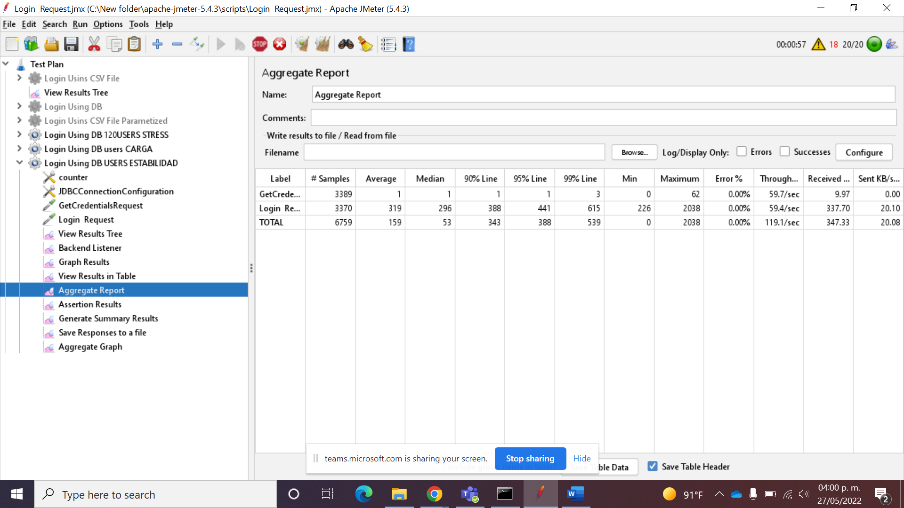
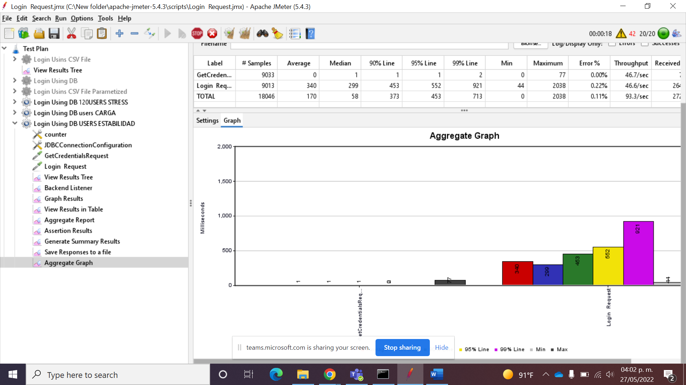

<!-- PROJECT LOGO -->
 

  

<h3 align="center">Performance Testing</h3>
<h4 align="center">Sesión 5 - Métricas de rendimiento y análisis de resultados de pruebas</h4>

## Integrantes

* Roberto Bertrand Lizárraga
* Iván Montiel Cardona
* Mungarro Echeverría Héctor
* Salmerón González Victor

## Desarollo
En esta sesión crearemos un proyecto en JMeter donde haremos 3 diferentes tipos de pruebas (carga, estrés y estabilidad) con el fin de analizar resultados de ejecuciones.

### Requerimientos

* Crear un TestPlan con sus elementos de prueba, grabación y resultados.
* Grabar escenario de prueba
	* Configurar el Thread Group con usuarios para pruebas de carga
		* Ejecutar prueba
		* Revisar elementos de resultados
	* Configurar el Thread Group con usuarios para pruebas de estrés
		* Ejecutar prueba
		* Revisar elementos de resultados
	* Configurar el Thread Group con usuarios para pruebas de estabilidad
		* Ejecutar prueba
		* Revisar elementos de resultados
* Presentar los resultados de las 3 pruebas de acuerdo al reporte resumen mostrando min, max, promedio y % de error para definición de métricas.
* Presentar los respectivos gráficos por cada una de las pruebas y escribir el análisis de resultados que se puede ver.

### Resultados

  

 

  

  

 

  

 

  

 

  

  

 

  

  

 

  

  

 

  

  

## Licencia
Distribuido bajo la licencia GNU. Consulte `LICENCE` para obtener más información.

##### Equipo 2