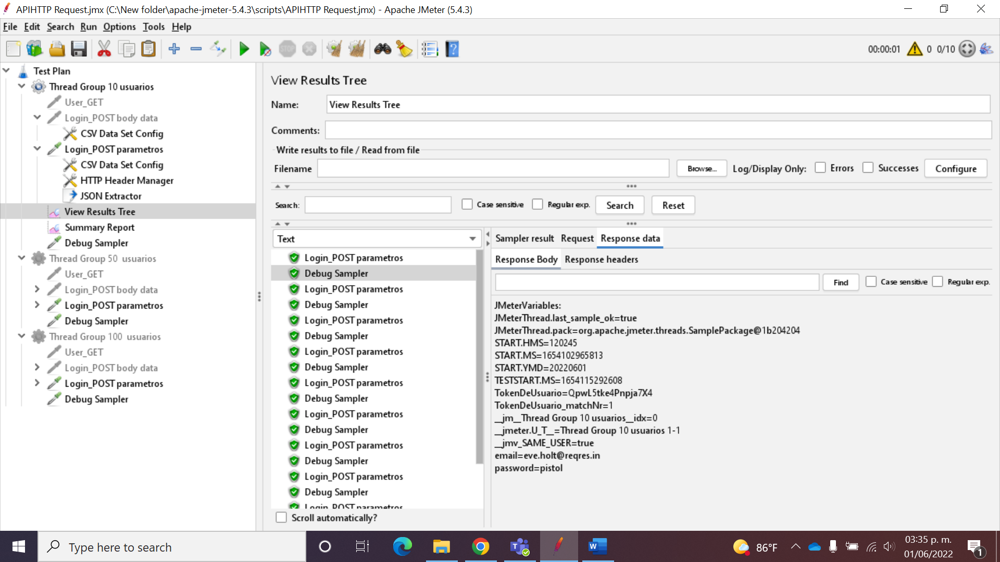

<!-- PROJECT LOGO -->
 

  

<h3 align="center">Performance Testing</h3>
<h4 align="center">Sesión 8 - Pruebas de API</h4>

## Integrantes

* Roberto Bertrand Lizárraga
* Iván Montiel Cardona
* Mungarro Echeverría Héctor
* Salmerón González Victor

## Desarollo
En esta sesión crearemos un proyecto en JMeter donde consumamos una API y utilicemos datos de prueba desde un archivo CSV.

### Requerimientos

* Obtener API de prueba
* Crear proyecto en JMeter con los elementos para pruebas de carga y estrés
* Crear la solicitud HTTP para el consumo de la API
* Incorporar archivo CSV
* Agregar el formato de respuesta JSON
* Indicar método (GET-POST) para inicio de la prueba
* Agregar JSON Extractor e indicar la expresión que se desea extraer
* Preparar la prueba indicando 10 usuarios simulados
* Ejecutar el proyecto
* Presentar resultado Sampler
* Presentar request
* Presentar response
 

* Realizar el mismo proceso con 50 usuarios simulados
* Realizar el mismo proceso con 100 usuarios simulados

### Resultados

  

 

  

  

 

  

 

  

 

  

  

 

  

  

 

  

  

 

  

## Licencia
Distribuido bajo la licencia GNU. Consulte `LICENCE` para obtener más información.

##### Equipo 2
